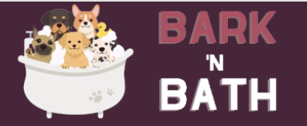

---

# *Bark 'n bath dog grooming salon*
People can explore the Bark 'n Bath website to discover details about the "Bark 'n Bath" company and its dog grooming services. Visitors can easily reach out to schedule a dog grooming session or make an appointment.

The site can be accessed by this [link](https://vtoth13.github.io/bark-n-bath/)

---
## User Stories

* As a first-time visitor, I want an easy understanding of the website, so I can learn more about the company.
* As a first-time visitor, I want to effortlessly navigate the website, so I can find the content I am looking for. 
* As a first-time visitor, I want to learn about the team of the company, so I can get to know them before I even visit personally.
* As a first-time visitor, I want to get an overview of the services, so I can decide which service I would like to use.
* As a first-time visitor, I want to see other customers' opinions, so I can see whether the company is trustworthy.
* As a returning visitor, I want to see the opening hours, so I can visit the company in person. 
* As a returning visitor, I want to find community links, so I can experience more about the company and its connections.
* As a frequent user, I want a contact form, so I can easily request an appointment.
* As a frequent user, I want the website to be responsive, so I can visit the website using my phone or tablet.

## Features

### Home page

- ##### Navigation

  - Positioned at the top of the page.
  - Contains the logo of the dog grooming salon in the left corner.
  - On the right side, there are navigation links:
    - Home - leads to the home page.
    - Services - leads to the services page.
    - Gallery - leads to the gallery page.
    - Contact - leads to the contact form page.
  - If the link of the page is hovered over, it's underlined.
  - The navigation is clear and easy to understand for the user.
  - The navigation bar is responsive and appears in the form of a hamburger menu on mobile devices.

  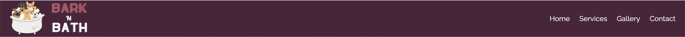
  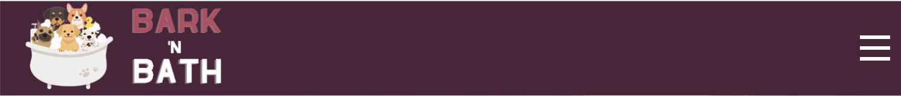

---

- ##### Hero section
  - Hero sections have background images.
    - The hero section shows in the middle of the message on the page
    - It has shadows
    - It highlights the function of the page
   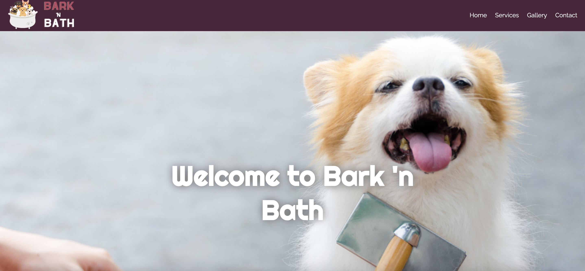

--- 

- ##### About Us section
  - The "About us" section contains an image on the right side, which shows the team members.
  - The "About us" section provides information about the dog grooming salon.
  - The "About us" section tells the user why they should visit this dog grooming salon.
    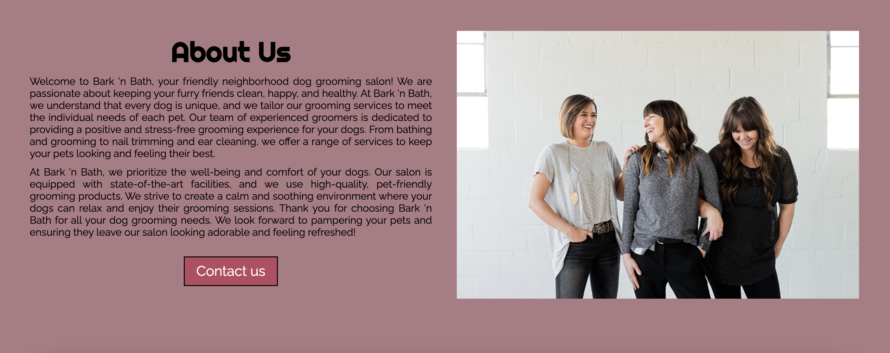

---

- ##### Our Team section
    - This section contains three cards of the three dog groomers.
  - The cards show the experience and the picture of the staff members.
  - The cards have shadows around them.

  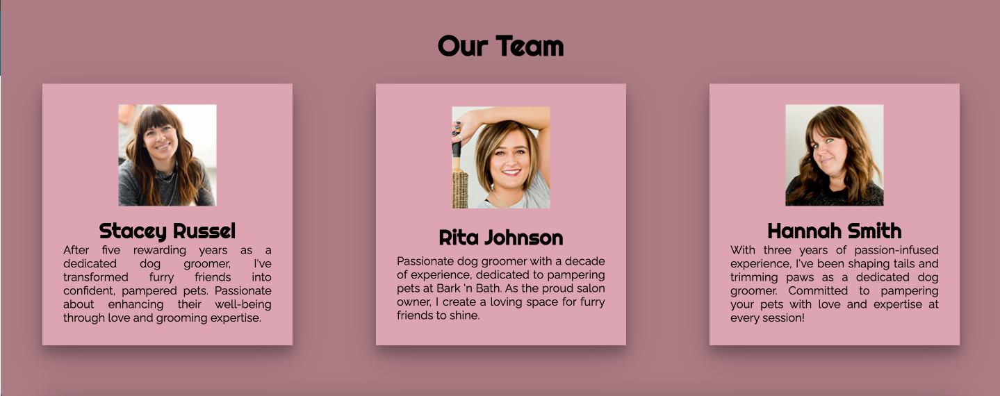

    ---
+ #### Testimonials Section

    - The Testimonials Section features three positive reviews from satisfied customers who experienced the company's excellent service.
    - Each card has a picture of the animal's owner.
    - There is also a Call to Action button.
​
    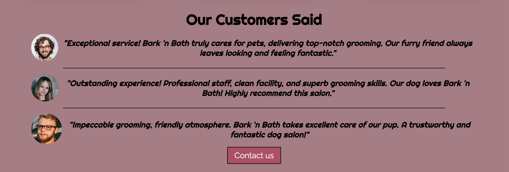

---
+ #### Opening Hours Section

    - The Opening Hours section shows the customers when they can visit the salon.

    - It is also in bold font so it is easy to notice.
​
    

---
+ #### Footer

    - The Footer contains the social media links that open in a new tab.
​
    

    ---

- #### Services Page

  - The Services page contains the services provided by the company.
  - The Services page also contains a hero section but with another background image and text.
  - Under the hero section, there are four different sections:
    - Most Popular services and a call to action button
    - A picture
    - Other services and a call to action button
    - The opening hours
  - Each of these sections tells the user about the services of the company.

  
​
---
+ ### Gallery Page

    - The Gallery page has a hero image and the name of the page.
    - It has photos of the animals that already used the services of the company.
        - The gallery is responsive: the size of the photo depends on the user's screen.
    - It has a footer identical to the home page's footer.
    
​
    

---
+ ### Contact page

    - The Contact page has a contact form:
        - All text input fields are customized.
        - Labels are animated when the input field is in focus and are not empty.
        - All inputs are set to be required to be filled out except the text field.
        - It has two dropdown fields for the visitors to choose services.

            - The 1st is - "Service of Choice", which helps the company plan the appointments.
            - The 2nd is - "Breed size", which helps to company with the organization of the supplies.
        - The submit button has a shadow on the hover.
    - The page is responsive on all common screen sizes.
    - The submit button leads to the response page.
​
    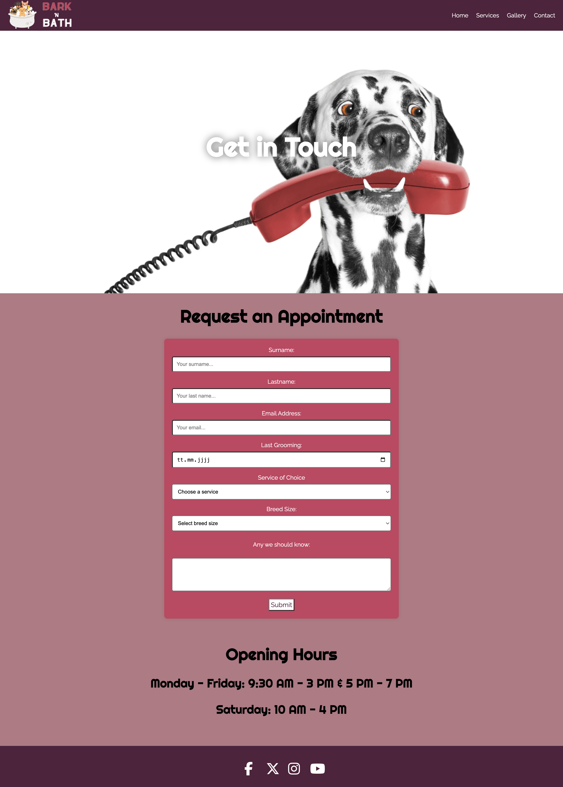

---
+ ### Response page

    - The Response page appears after submitting the contact form.
    - It contains the thank you message and the promise to get in touch with the applicant.
    - It has a button to return to the home page.

    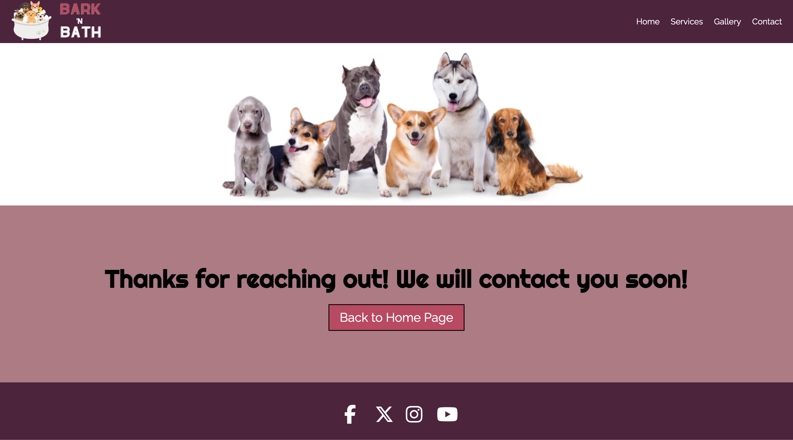

---

## Technologies used

- HTML - was used as the foundation of the site.
- CSS - was used to add the styles and layout of the site, arrange items symmetrically on the pages, declare global CSS variables and apply them throughout the project.
- Font Awesome icons - were used for the social media icons.
- Google Fonts - were used to import fonts.
- Balsamiq - was used to make wireframes for the website.
- VS Code - was used as the main tool to write and edit code.
- GitHub - was used to host the code of the website.
- Photoshop - was used for the pictures in the README.md
---
## Design

### Color Scheme

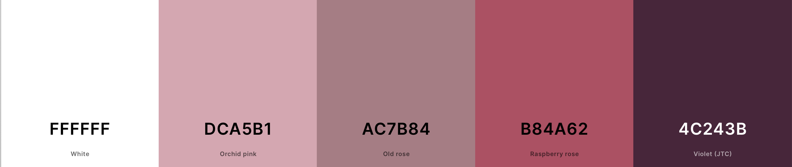

- The Old Rose color was used as the main color of the website because the old rose conveys a vintage and nostalgic vibe, creating a sense of timeless charm and the muted tone of the old rose adds an element of subdued elegance.

- The Orchid Pink and the Raspberry Rose colors were used as backgrounds for the cards and buttons. 

    - The Orchid Pink color brings a touch of femininity and elegance to the design and adds warmth and a welcoming feel to the overall aesthetic.
    - The Raspberry Rose color serves as a bold accent color, drawing attention to specific elements and the vibrant hue represents passion and energy, injecting vitality into the design.

- The Violet (JTC) color was used as the color of the navigation bar and the footer. Violet is associated with creativity and imagination, making it suitable for a visually engaging website. The color also has a calming effect, balancing the overall color palette.

### Typography

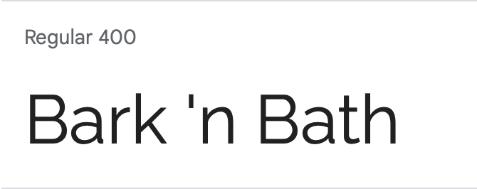

- The Raleway Google Font was used as the main font of the website to increase the readability of the content on the pages.

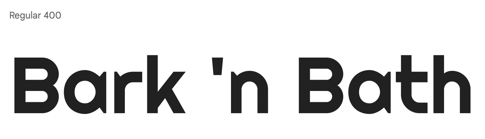

- The Righteous Google Font was used to attract viewers' attention to the important pieces of information.

### Wireframes

#### Mobile devices

- [Home Page. Mobile Screen](documentation/mobile_home_page.png)
- [Services Page. Mobile Screen](documentation/mobile_services_page.png)
- [Gallery Page. Mobile Screen](documentation/mobile_gallery_page.png)
- [Contact Page. Mobile Screen](documentation/mobile_contact_page.png)

#### Desktop

- [Home Page. Desktop Screen](documentation/desktop_home_page.png)
- [Response Page. Desktop Screen](documentation/desktop_services_page.png)
- [Gallery Page. Desktop Screen](documentation/desktop_gallery_page.png)
- [Contact Page. Desktop Screen](documentation/desktop_contact_page.png)

---

## Testing

Please refer to the [TESTING.md](TESTING.md) file for all test-related documentation.

---

## Deployment

### Deployment to GitHub Pages

- The site was deployed to GitHub pages. The steps to deploy are as follows: 
  - In the [GitHub repository](https://github.com/vtoth13/bark-n-bath), navigate to the Settings tab 
  - From the source section drop-down menu, select the **Main** Branch, then click "Save".
  - The page will be automatically refreshed with a detailed ribbon display to indicate the successful deployment.

The live link can be found [here](https://vtoth13.github.io/bark-n-bath/index.html)

### Local Deployment
To make a local copy of this project, you can clone it.
In your IDE Terminal, type the following command to clone my repository:

- `git clone https://github.com/vtoth13/bark-n-bath.git`

- Alternatively, if you use Gitpod, you can [click here](https://gitpod.io/#https://github.com/vtoth13/bark-n-bath), which will start the Gitpod workspace for you.

---

## Future improvements
- add favicon with [Favicon Generator. For real.](https://realfavicongenerator.net/);
- add custom 404 page;
- add accessibility report with [WAVE Web Accessibility Evaluation Tool](https://wave.webaim.org/);
- improve the quality of the commit messages (I acknowledge that some of them are unclear and fall short of standards. I plan to enhance them in the future.)
---

### Credits

- ##### Content
  - The code to make social media links was taken from the Code Institute [Love Running](https://github.com/lexach91/love-running-project) project and modified to fit my website.
  - To make a responsive hamburger menu I watched some videos of [Kevin Powell](https://www.youtube.com/user/KepowOb) on his YouTube channel.

- ##### Media
  - All the images for the website were taken from [Unsplash](https://unsplash.com/)

---

## Acknowledgments

- [Iuliia Konovalova](https://github.com/IuliiaKonovalova) was a great mentor and I express my sincere gratitude to my mentor for invaluable guidance and support throughout my project. Their expertise and encouragement significantly contributed to the success of this endeavor.
- [Code Institute](https://codeinstitute.net/) tutors and Slack community members for their support and help.
- [Kevin Powell](https://www.youtube.com/user/KepowOb) for his amazing CSS tutorials.

---
